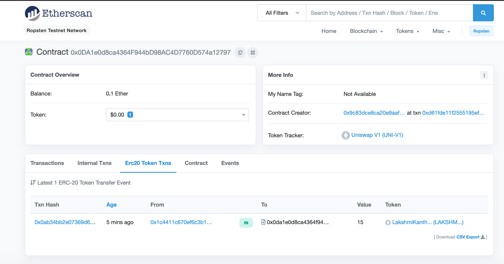
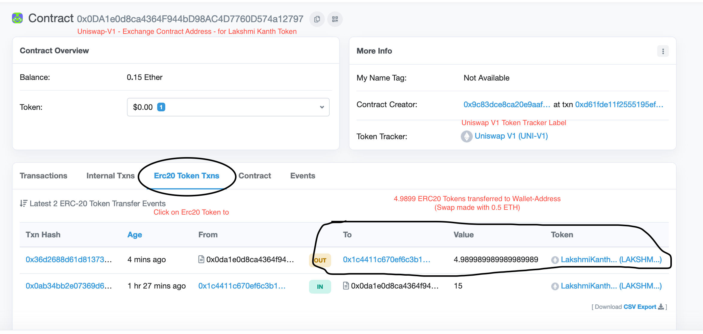

# UniSwapper - Swap Token Assets on Uniswap 

-----
## How UniSwap works?
-----

```
Uniswap is made up of a series of ETH-ERC20 exchange contracts.

There is exactly one exchange contract per ERC20 token.

If a token does not yet have an exchange it can be created by 
anyone using the Uniswap factory contract. 

The factory serves as a public registry and is used to look up all token
and exchange addresses added to the system.
```

-----
## How UniSwap-Exchange Contract is operated?
-----

```
Each exchange holds reserves of both ETH and its associated ERC20 token. 
Anyone can become a liquidity provider on an exchange and contribute to its reserves. 

This is different than buying or selling; it requires depositing
an equivalent value of both ETH and the relevant ERC20 token. 
```

-----
## How is liquidity handled in UniSwap-Exchange Contract?
-----

```
Liquidity is pooled across all providers and an internal “pool token” (ERC20) 
is used to track each providers relative contribution.

Pool tokens are minted when liquidity is deposited into the system and 
can be burned at any time to withdraw a proportional share of the reserves.

Exchange contracts are automated market makers between an ETH-ERC20 pair. 
```

-----
## How tokens are swapped using UniSwap-Exchange Contract?
-----

```
Traders can swap between the two in either direction by adding to the
liquidity reserve of one and withdrawing from the reserve of the other. 

Since ETH is a common pair for all ERC20 exchanges, it can be used as an 
intermediary allowing direct ERC20-ERC20 trades in a single transaction. 

Users can specify a recipient address if they want to receive purchased tokens 
at a different address from the one used to make a transaction.
```

-----
## Use case:
-----

1. I have my token named as LAKSHMI_KANTH_TOKEN

   Ropsten: 
   https://ropsten.etherscan.io/address/0x832f1854532927a061790e8d1e432c66985eca29

2. User can mint LAKSHMI_TOKEN using their ETH

3. My Agenda is to enable users to easily:
   - swap ETH for LAKSHMI_TOKEN
   - swap LAKSHMI_TOKEN for LINK_TOKEN

4. Each Token Swap has an associated ExchangeContract. 
    i.e an exclusive contract for each Token pair

5. We will deploy an Exchange contract with pair: ETH & LAKSHMI

6. Exchange TokenContract can be used to swap ETH for LAKSHMI_TOKEN and vice-versa

7. We will showcase on how user can swap their LAKSHMI_TOKEN for a LINK_TOKEN

-----
## Testnet 
-----

 - We will be using Ropsten testnet for deployment of Token and Exchange Contracts
 - Deployer address and privateKey are provided here. 
   - As this is only tesnet, i am providing keys here
   - PLEASE DONT SHARE any mainnet Keys

```js
const OWNER = '0x1c4411c670Ef6c3B1009B5D13C3822b977b52ce1';
const OWNER_PRIVATE_KEY = '7b686b07e74fb5669b45a3eedb03b7af7ca69763b2a1a941815d210f3e1b5729';
```

 - contract Addresses on Ropsten:

  - Uniswap Factory Contract on Ropsten:

  ```js
    const ropsten = '0x9c83dCE8CA20E9aAF9D3efc003b2ea62aBC08351'
    https://ropsten.etherscan.io/address/0x9c83dCE8CA20E9aAF9D3efc003b2ea62aBC08351
  ```

-----
## Pre-Requisites for Project:
-----

1. node > version 10
2. npm / yarn
3. truffle

- install all dependencies essential for project

```shell
 yarn
```

-----
## Deploy an ERC20 token - LakshmiKanthToken to Ropsten
-----

1. Create a Simple ERC20 Token contract

```js
contract LakshmiKanthToken is Ownable, ERC20Detailed, ERC20Capped {

    using SafeMath for uint256;

     uint256 CAP = 1000000000;
     uint256 TOTALSUPPLY = CAP.mul(10 ** 18);

	constructor()
		public
		ERC20Detailed('LakshmiKanthToken', 'LAKSHMI_KANTH_TOKEN', 18)
		ERC20Capped(TOTALSUPPLY)
		Ownable()
	{
		_mint(msg.sender, TOTALSUPPLY);
	}
}
```

2. Deploy to Ropsten using truffle framework

```shell
$ truffle migrate 
```

3. Console log

```js
lakshmikanth-MacBook-Pro:UniSwapper lakshmikanth$ truffle migrate --reset --network ropsten_infura

Compiling your contracts...
===========================
> Compiling ./contracts/LakshmiKanthToken.sol
> Artifacts written to /Users/lakshmikanth/Documents/finxflow/UniSwapper/build/contracts
> Compiled successfully using:
   - solc: 0.5.16+commit.9c3226ce.Emscripten.clang


Starting migrations...
======================
> Network name:    'ropsten_infura'
> Network id:      3
> Block gas limit: 8000000 (0x7a1200)


1_initial_migration.js
======================
1_initial_migration:  ropsten_infura

   Replacing 'Migrations'
   ----------------------
   > transaction hash:    0x2019697efa0fbd64c3f9fd6082f99d0376d06883939c64d47cdfc53e4c4f7ca4
   > Blocks: 1            Seconds: 21
   > contract address:    0x9c8EFEa9201294d39b04d336A7Ae31512A9302a0
   > block number:        8982935
   > block timestamp:     1604193534
   > account:             0x1c4411c670Ef6c3B1009B5D13C3822b977b52ce1
   > balance:             0.92440753
   > gas used:            225225 (0x36fc9)
   > gas price:           30 gwei
   > value sent:          0 ETH
   > total cost:          0.00675675 ETH

   Pausing for 1 confirmations...
   ------------------------------
   > confirmation number: 1 (block: 8982936)

   > Saving migration to chain.
   > Saving artifacts
   -------------------------------------
   > Total cost:          0.00675675 ETH


2_deploy_contracts.js
=====================

   Deploying 'LakshmiKanthToken'
   -----------------------------
   > transaction hash:    0x17d78eda02f46addcacba47056af88008cb692c56907fb0ce81e7a54b5222216
   > Blocks: 2            Seconds: 13
   > contract address:    0x832f1854532927A061790E8d1E432C66985ecA29
   > block number:        8982941
   > block timestamp:     1604193598
   > account:             0x1c4411c670Ef6c3B1009B5D13C3822b977b52ce1
   > balance:             0.86314513
   > gas used:            1999717 (0x1e8365)
   > gas price:           30 gwei
   > value sent:          0 ETH
   > total cost:          0.05999151 ETH

   Pausing for 1 confirmations...
   ------------------------------
   > confirmation number: 1 (block: 8982943)
lakshmiKanthToken is deployed with Address: 0x832f1854532927A061790E8d1E432C66985ecA29

   > Saving migration to chain.
   > Saving artifacts
   -------------------------------------
   > Total cost:          0.05999151 ETH


Summary
=======
> Total deployments:   2
> Final cost:          0.06674826 ETH


- Etherscan for Events emitted during token creation:

  https://ropsten.etherscan.io/tx/0x17d78eda02f46addcacba47056af88008cb692c56907fb0ce81e7a54b5222216
```


-----
## Usecase Details & Execution Steps:
-----

1. Create an Exchange-Contract for LakshmiKanth Token
2. Verify if the UniSwap-Exchange-Contract_LakshmiKanth_Token has-been created successfully by querying the Uniswap-Exchange-Factory Contract
3. Approve the Spending of LakshmiKanth Token for UniSwap-Exchange-Contract_LakshmiKanth_Token
4. Add Liquidity of LakshmiKanth Token and some ETH to the UniSwap-Exchange-Contract_LakshmiKanth_Token
5. Buyer with a walletAddress will exchange ETH for LakshmiKanth Token
6. Buyer with LakshmiKanthToken Assets will exchange LakshmiKanth-Token for the Link Tokens
   - Buyer will allow approval of spending of Lakshmikanth-Token to UniSwap-Exchange-Contract_LakshmiKanth_Token
   - Uniswap-V1 will exchange LakshmiKanthToken for ETH, then it will communicate with Exchange-Contract of Link Token
   - Uniswap-V1 will then exchange ETH for LINK tokens

   - UniSwap-V1 has a 2 step process to exchange ERC20 (Token-A) <-> ERC20 (Token-B)

      i. Exchange ERC20 (Token-A) for ETH on Exchange-Token-Contract of Token-A
      ii. Exchange ETH for ERC20 (Token-B) on Exchange-Token-Contract of Token-B


 - This Usecase contains execution of 5 scripts in Sequence to simulate the 7 Steps mentioned above:


-----
## Javascript files for Usecase:
-----
- 6 Javascript files are programmed to execute all the 6 steps listed in Use-Case described in next Section

 - source directory: all JS files are under `scripts/`  of root directory

    |#|	FileName | Command |	Addresses |	Description|
    | --- | --- |--- |--- |--- |
    |0| [CreateUniswapTokenExchangeContract](./scripts/CreateUniswapTokenExchangeContract.js) | node commands/CreateUniswapTokenExchange.js |	| Create a Uniswap-Exchange-Contract for ERC20 Token |
    |1|	[QueryUniswapTokenExchangeContract](./scripts/QueryUniswapTokenExchangeContract.js)   |node command/QueryUniswapTokenExchange.js || Query the Exchange-Contract address using Uniswap Exchange Factory Contract|
    |3|	[ApproveTokenSpendingForUniswapExchangeContract](./scripts/ApproveTokenSpendingForUniswapExchangeContract.js)  |node command/ApproveTokenSpending.js   |	| Approve Spending of ERC20 token for the Exchange-Contract|
    |4|	[AddLiquidityToExchangeContract](./scripts/AddLiquidityToExchangeContract.js)  | node command/AddLiquidityCommand.js   |	| Add Liquidity ERC20, ETH to the ERC20-Exchange-Contract|
    |5|	[SwapETHForERC20Token](./scripts/SwapETHForERC20Token.js)  | node command/SwapETHForERC20Token.js  |	| User to sell ETH and buy ERC20 Token available on ERC20-Exchange-Contract|
    |6|	[SwapERC20ForERC20Token](.scripts/SwapERC20ForERC20Token.js) | node command/SwapERC20ForERC20Token.js    |	| User to swap ERC20 token for another ERC20 token|
SwapETHForERC20Token
-----
### Step-1: Script to create new Exchange-Contract from Factory:
-----

 - Run javaScript file: 

```sh
    node ./scripts/CreateUniswapTokenExchangeContract.js
```

#### Script Execution Log:

 - Ropsten Etherscan for Exchange-Contract creation:

```js
    https://ropsten.etherscan.io/tx/0xd61fde11f2555195efe003655fd3b543642fc45ff72f50b79ddd0091162c9dd8#eventlog
```

 - Uniswap Exchange Contract Address (LAKSHMI_KANTH_TOKEN):

   - LakshmiKanth Token Contract Address: 0x832f1854532927a061790e8d1e432c66985eca29
   - Uniswap Exchange Contract for LakshmiKanth-Token : 0x0da1e0d8ca4364f944bd98ac4d7760d574a12797

   - Etherscan for Exchange Contract: https://ropsten.etherscan.io/address/0x0da1e0d8ca4364f944bd98ac4d7760d574a12797

-----
### Step-2: Verify if the Exchange-Contract has-been created by querying the Uniswap-Exchange-Factory Contract
-----

 - Execute command to Query the ExchangeContract Address for LakshmiKanthToken
```sh
    node scripts/QueryUniswapTokenExchangeContract.js 
```

- Terminal Logs:

```
    output of  exchange-address-Query for LakshmiKanth token is: 0x0DA1e0d8ca4364F944bD98AC4D7760D574a12797
    Exchange Address for LakshmiKanth Token in previous Step is: 0x0da1e0d8ca4364f944bd98ac4d7760d574a12797
```

-----
### Step-3: Approve the Spending of LakshmiKanth Token for UniSwap Exchange-Contract of LakshmiKanth Token
-----

 - This is also considered as adding liquidity to Uniswap-Exchange-Contract

 ```sh
    node command/ApproveTokenSpending.js 
 ```

 - Terminal Log:

 ```
    sent 0x798d058e3bfa7f997e4946cbdea2e284e425c4dbcf583ecace48fb2b9de056aa
 ```

 - Etherscan:  https://ropsten.etherscan.io/tx/0x798d058e3bfa7f997e4946cbdea2e284e425c4dbcf583ecace48fb2b9de056aa#eventlog

-----
### Step-4: Add Liquidity of LakshmiKanth Token and some ETH to the Exchange-Contract of LakshmiKanth Token
-----


 - LakshmiKanthTokens as well as ETH will be added as Liquidity to the Exchange Token Contract

 ```sh
  node command/AddLiquidityCommand.js
 ```

 - Terminal Logs:

 ```
 sent 0x0ab34bb2e07369d6a38513f8a1f3664e761ae516acca13ab6f3ef903e45f199b
 ```

- Event Emitted from AddLiquidity Function Call:

    |#|	Name |	Type |	Data|
    | --- | --- |--- |--- |
    |0|	min_liquidity|	uint256| 1 |
    |1|	max_tokens   |	uint256| 15000000000000000000|
    |2|	deadline     |	uint256| 1742680400|

minimum Liquidity: 1
maximum Tokens: 15 LakshmiKanth Tokens (15 * 1e18)
deadline: 1742680400

EtherScan: https://ropsten.etherscan.io/tx/0x0ab34bb2e07369d6a38513f8a1f3664e761ae516acca13ab6f3ef903e45f199b

EtherScan Logs: https://ropsten.etherscan.io/tx/0x0ab34bb2e07369d6a38513f8a1f3664e761ae516acca13ab6f3ef903e45f199b#eventlog


#### Verify the Funding of Tokens to ExchangeContract



-----
## Step-5: Buyer with a walletAddress will exchange ETH for LakshmiKanth Token
-----

- Command to execute:

```sh
 node scripts/SwapETHForERC20Token.js 
```

- terminal Logs:

```
etherToSpendForERC20: 0xb1a2bc2ec50000 - inEth: 0.05
sent 0x36d2688d61d8137329b5bfb73ac5dcb6cc4e443462507026903ef2021ffaf40e
```

- Etherscan Proofs:

 - transactionHash: 0x36d2688d61d8137329b5bfb73ac5dcb6cc4e443462507026903ef2021ffaf40e
 - Etherscan Link: https://ropsten.etherscan.io/tx/0x36d2688d61d8137329b5bfb73ac5dcb6cc4e443462507026903ef2021ffaf40e
 - InputData for function from EtherscaN:

 ```
 Function: ethToTokenSwapInput(uint256 min_tokens, uint256 deadline) ***

    MethodID: 0xf39b5b9b
    [0]:  0000000000000000000000000000000000000000000000000000000000000001
    [1]:  0000000000000000000000000000000000000000000000000000000067df3150
 ``` 


 #### Verify the Token transfer transaction on Etherscan (Tonken Tracker: Uniswap V1)


 
-----
### Step-6: Buyer with LakshmiKanthToken Assets will exchange LakshmiKanth-Token for the Link Tokens
-----

 - Run command to swap ERC20 Tokens

 ```sh
    node scripts/SwapERC20ForERC20Token.js 
 ```

 - Terminal Logs:
 ```
 sent 0xbf44f4d342a9e3ba1ce38f7841dc22b94273bff4f866750fc95b036c6b31b5db
 ```

- Etherscan Proofs:

  - transactionHash: 0xbf44f4d342a9e3ba1ce38f7841dc22b94273bff4f866750fc95b036c6b31b5db


