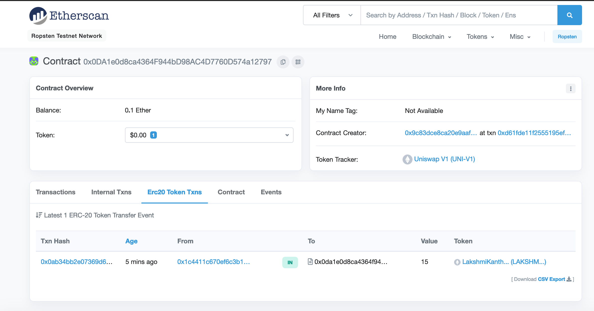

# Create Token-Exchange-Contract in Uniswap V1

## Introduction:

 - Uniswap Factory contract has been deployed by Uniswap on Ropsten.
 - Its ABI and code can be found in the ./abi directory of this project

 - contract Addresses on Ropsten:

  - Uniswap Factory Contract on Ropsten:

```js
const ropsten = '0x9c83dCE8CA20E9aAF9D3efc003b2ea62aBC08351'
https://ropsten.etherscan.io/address/0x9c83dCE8CA20E9aAF9D3efc003b2ea62aBC08351
```

  - Create a Token pair from etherscan:

```js
    https://ropsten.etherscan.io/address/0x9c83dCE8CA20E9aAF9D3efc003b2ea62aBC08351#writeContract
```

## Script to create new Exchange-Contract from Factory:

 - Run javaScript file: 

```sh
    node ./scripts/CreateUniswapTokenExchangeContract.js
```

## Script Execution Log:

 - Ropsten Etherscan for Exchange-Contract creation:

```js
    https://ropsten.etherscan.io/tx/0xd61fde11f2555195efe003655fd3b543642fc45ff72f50b79ddd0091162c9dd8#eventlog
```

 - Uniswap Exchange Contract Address (LAKSHMI_KANTH_TOKEN):

   - LakshmiKanth Token Contract Address: 0x832f1854532927a061790e8d1e432c66985eca29
   - Uniswap Exchange Contract for LakshmiKanth-Token : 0x0da1e0d8ca4364f944bd98ac4d7760d574a12797

   - Etherscan for Exchange Contract: https://ropsten.etherscan.io/address/0x0da1e0d8ca4364f944bd98ac4d7760d574a12797

## Query created Exchange

```sh
lakshmikanth-MacBook-Pro:UniSwapper lakshmikanth$ node scripts/QueryUniswapTokenExchangeContract.js 
output of  exchange-address-Query for LakshmiKanth token is: 0x0DA1e0d8ca4364F944bD98AC4D7760D574a12797
Exchange Address for LakshmiKanth Token in previous Step is: 0x0da1e0d8ca4364f944bd98ac4d7760d574a12797
```

## Aprove LakshmiKanthToken Spending for Uniswap-Exchange-Contract-Address of LakshmiKanthToken

 - This is also considered as adding liquidity to Uniswap-Exchange-Contract

 ```js
 lakshmikanth-MacBook-Pro:UniSwapper lakshmikanth$ node scripts/ApproveTokenSpendingForUniswapExchangeContract.js 
(node:53484) [DEP0005] DeprecationWarning: Buffer() is deprecated due to security and usability issues. Please use the Buffer.alloc(), Buffer.allocUnsafe(), or Buffer.from() methods instead.
sent 0x798d058e3bfa7f997e4946cbdea2e284e425c4dbcf583ecace48fb2b9de056aa
 ```

 - Etherscan:  https://ropsten.etherscan.io/tx/0x798d058e3bfa7f997e4946cbdea2e284e425c4dbcf583ecace48fb2b9de056aa#eventlog


## Add Liquidity to ExchangeContract

 - LakshmiKanthTokens as well as ETH will be added as Liquidity to the Exchange Token Contract

 ```sh
  node scripts/AddLiquidityToExchangeContract.js
 ```

 - Terminal Logs:

 ```
 (node:61651) [DEP0005] DeprecationWarning: Buffer() is deprecated due to security and usability issues. Please use the Buffer.alloc(), Buffer.allocUnsafe(), or Buffer.from() methods instead.
 sent 0x0ab34bb2e07369d6a38513f8a1f3664e761ae516acca13ab6f3ef903e45f199b
 ```

- Event Emitted from AddLiquidity Function Call:

    |#|	Name |	Type |	Data|
    |0|	min_liquidity|	uint256| 1 |
    |1|	max_tokens   |	uint256| 15000000000000000000|
    |2|	deadline     |	uint256| 1742680400|

minimum Liquidity: 1
maximum Tokens: 15 LakshmiKanth Tokens (15 * 1e18)
deadline: 1742680400

EtherScan: https://ropsten.etherscan.io/tx/0x0ab34bb2e07369d6a38513f8a1f3664e761ae516acca13ab6f3ef903e45f199b

EtherScan Logs: https://ropsten.etherscan.io/tx/0x0ab34bb2e07369d6a38513f8a1f3664e761ae516acca13ab6f3ef903e45f199b#eventlog


### Verify the Funding of Tokens to ExchangeContract

 [Add_Liquidity_LakshmiKanth_To_UniSwap-V1-Exchange-Contract.png]




